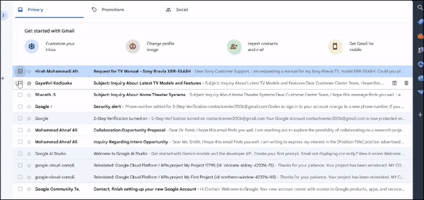

# ConvoAI: Automated Email Reply System Using Google Gemini


ConvoAI is an AI-powered system designed to automate email replies using Google Gemini and Gmail API as a callcenter agent(you can change the prompt to Gemini). This guide will walk you through the setup and usage of the project.
## Demo



## Features

- Access your Gmail account using the provided credentials.
- Filter for emails labeled as "unread."
- Generate replies using Google Gemini.
- Send the generated replies via SMTP.
## Prerequisites

Before you begin, ensure you have the following installed:

- Python 3.7 or later
- Pip (Python package installer)
- Gmail API enabled for your Google account
- Google Gemini API access
- Required Python libraries (listed in `requirements.txt`)

## Setup Instructions

### 1. Update `gemini.py`

1. **Obtain your `API Key`:**
   - Follow the instructions provided by GoogleGemini to generate your key for  Gemini API and update in (os.environ['GOOGLE_API_KEY']="[your key here]").
   - This token allows ConvoAI to access and interact with the Google Gemini service.


### 2. Replace `credentials.json`

1. **Obtain `credentials.json`:**
   - Refer to the [Google Gmail API Python Quickstart Guide](https://developers.google.com/gmail/api/quickstart/python) to set up your credentials.
   - Download the `credentials.json` file provided by Google after setting up your project in the Google Cloud Console.

2. **Replace the existing `credentials.json`:**
   - Place your `credentials.json` file in the root directory of this project, replacing the existing file.

### 3. Install Dependencies

Run the following command to install the required Python libraries:

```bash
pip install -r requirements.txt
```
### 4. Running the Project
To start ConvoAI, run the following command:
```bash
python main.py
```
ConvoAI will:

Access your Gmail account using the provided credentials.
Filter for emails labeled as "unread."
Generate replies using Google Gemini.
Send the generated replies via SMTP.

###5. Troubleshooting
Token Expiration: If your token.json expires, regenerate it by following the steps for the Gemini API.
API Errors: Ensure your APIs are correctly set up and that your credentials are valid.

###Contributing
Feel free to contribute to this project by opening a pull request or reporting issues.
